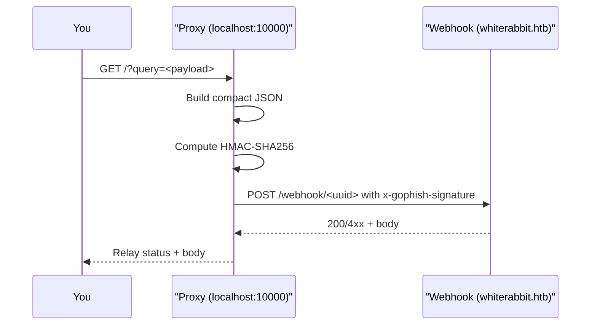

# WhiteRabbit-Proxy

> Lightweight **HMAC-signing proxy** to help test the webhook endpoint on the Hack The Box **WhiteRabbit** box with parameterized payloads (e.g., for SQLi research).  
> This proxy **is not an exploit**. It merely computes the expected HMAC for the JSON body and forwards your request to the target webhook.

---

## What this is

The WhiteRabbit machine exposes a webhook where the **Get Current Phishing Score** node accepts JSON like:

```json
{"campaign_id":1,"email":"<value>","message":"Clicked Link"}
```

Direct tools (like `sqlmap`) fail because the endpoint enforces an **HMAC signature** and rejects unsigned/invalid bodies with `Invalid Signature`.  
This proxy listens locally, accepts your payload via a query parameter, **calculates the correct HMAC**, and **POSTs** the request to the real webhook.

---

## How it works (at a glance)


**Implementation notes**  
- HTTP server on `localhost:10000` (single-request loop).  
- Expects **`query`** parameter carrying your test input (e.g., candidate SQLi).  
- Signs the compact JSON with `HMAC‑SHA256` and sends header `x-gophish-signature: hmac=<hex>`.  
- Forwards the webhook response body/status back to the client.

---

## Setup

```bash
python3 -m venv .venv && source .venv/bin/activate
pip install -r requirements.txt  # (requests)
# or: pip install requests
```

> The script uses only the standard library + `requests`.

---

## Usage

1. **Add the webhook host to `/etc/hosts`** (if needed for the HTB lab environment).
2. **Start the proxy**:
   ```bash
   python3 proxy.py
   # → listening on http://localhost:10000
   ```
3. **Try a manual request**:
   ```bash
   curl "http://localhost:10000/?query=test@example.com"
   ```
4. **Automate with sqlmap** (the proxy signs each request automatically):
   ```bash
   sqlmap "http://localhost:10000/?query=test" -p query --level 5 --risk 3 --batch
   ```

> The console shows every inbound request line; useful for watching `sqlmap` mutate payloads.

---

## Configuration

These constants live at the top of `proxy.py` and can be changed to match your lab:

```python
SECRET = "..."  # shared HMAC secret expected by the webhook
WEBHOOK_URL = "http://<host>/webhook/<uuid>"
```

- The proxy builds a payload object with fields `campaign_id`, `email`, and `message` and **compacts** it before signing.  
- HMAC is calculated as `HMAC_SHA256(secret, payload_json)` and sent via header `x-gophish-signature: hmac=<digest>`.

> Tip: If you want to pass additional JSON fields, extend the `Payload` class and keep the **same compaction and signing** routine.

---

## Ethics & scope

- For **authorized research and education** only. Respect HTB rules; **do not** target active machines unlawfully.  
- This proxy **does not bypass** authentication—it simply mirrors the client behavior of producing the expected HMAC for the JSON body.

---

## Troubleshooting

- **`Invalid Signature`**: ensure `SECRET` and `WEBHOOK_URL` are correct and the JSON is compacted exactly as the server expects.
- **No response / timeout**: verify host mapping and that the webhook is reachable from your lab.  
- **sqlmap sends extra params**: pin `-p query` to constrain injection testing to the intended parameter.  
- **Need concurrency**: the built-in server handles one request at a time; for heavier traffic, adapt to `ThreadingHTTPServer`.

---

## File layout

```
.
├── proxy.py
└── README.md  (this file)
```

---

## 📝 License

MIT — see `LICENSE`.
